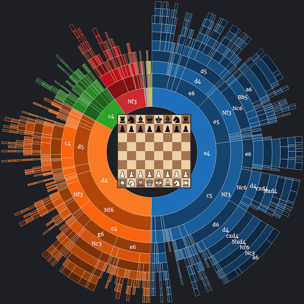

# Chess-Tactician

- [Chess-Tactician](#chess-tactician)
  - [Description](#description)
  - [Inspiration](#inspiration)
  - [Roadmap](#roadmap)
  - [Update Log](#update-log)
  - [Developers](#developers)

Description
---
Chess Tactician is a browser based extension that allows real time in game board capture for popular online chess sites such as Lichess.org and Chess.com. 

Chess Tactician aims to provide online chess players with a better in-game opening planning experience, allowing players to pre-plan moves according to their own unique opening repertoire and displaying them synchronously throughout online chess games.

Inspiration
---
Since the emergence of online chess sites in the early 2010s as well as an ongoing popularization of the game style mainly thanks to the streaming and show production industries, chrome extensions have become more and more prevalent in enhancing personal game experience. 

> I used to think that chrome extensions could only interact with webpages from a limited scope, these included manipulating text color, changing word size, saving/downloading resources found on a page’s index and css files etc.

Unfortunately, the majority of such extensions have been posed to compute optimal piece movement, via already mature chess engine technology. 

> After a chat with an online chess opponent, I was surprised to find that “cheating” in chess could be as easily accessible via a single click. No opening up stockfish, no switching between windows and apps, just a click on a top right extension icon and volla, you got your “best move”.

As much as this seems to worsen the already dire anti-cheating scene in online chess, this particular topic was of very little concern. 

> New cheating regulations have been put in place and nobody’s sweaty enough to yell "cheater" over an online board game. 
 
Online chess sites have long recieved complaints about tool assisted cheating, and have taken server side measures in response. Such responses include running cheating-detection algorithms, taking in player elo, game style and move quality to accurating predict player behavior.

> This however, did open up the possibility for newer projects to improve online chess experience, which we will discuss later, and I don’t mean straight up blatant cheating.

This cat-and-mouse scene in online chess has brought many questions to the surface, the most jarring and obvious being: How exactly should the functionalities of browser extensions in online chess be reasonably applied to improve player experience?

Having played online chess on and off for almost a decade, I immediately thought of the bottleneck issues I was facing as an intermediate chess player.

See, online chess, though featuring the same rules and settings, has its small but substantial differences with the base game played in person:

1. Online chess games are usually much shorter. Since games are not hosted in person, players can easily leave at anytime with reduced penalty. Blitz games between 3 and 10 minutes have been shown to be the most common time limits for online chess, compared to the usual 15 minute rapid game and the 45 minute standard format. This means players tend to be more focused, but typically with a reduced attention span.
2. Reduced reaction time. The reduced reaction time mentioned here refers to both the time the player takes to think, partially as a result of the first phenomenon, as well as the time a move a actually played and registered client side. This helps players focus more on strategizing, relieving some unwanted burden on time, such as potentially tipping over pieces while moving them. However, this also gives tool-assisted cheating more time to react. 

Back to the daily struggles of a amateur player. As one gradually familiarizes with opening traps, common mating patterns as well as key endgame positions, a lot of the fun is drained from online chess. Games start off with popular variations of popular openings, slowly slide into the middle game and are decided early before the end game, usually by resignation.

> The part about chess many enjoy the most is usually the middle game. Perceving attacks, manuvering pieces and setting them up. My rating’s currently at 1800-ish and I feel like I’m getting nowhere really. On a good day I could climb about 100 points or so but 2000 is a mark I can never reach. The problem’s probably that my middlegame theory isn’t trained enough. I think many other players have this problem, especially between 1200-2000. 

What can we do to improve this "meta"? 

Well, thinking back to the joys of a beginner, opening traps and early game gambits are definitely a catlyst for excitement.

> A great way to counter this is to carefully plan out opening lines, knowing your options and always considering a potential unorthodox line to throw out. Many people fret from playing agressive lines because it brings a lot of instability and with the position opened up requires memorizing dozens of lines. It’s even harder to test and reinforce this knowledge since there’re rare to come by and are too sparsely distributed.

However, such gambits are avoided when the playerbase starts to learn the direct counters. According to engine based move valuation, most gambits and "wild variations" usually yield subpar results compared to the main lines, which either involve early simplification (trading of pieces into the end game) or long positional closed games.

Nobody wants to play online chess with an opening book. 

And we get it, cheating isn’t fun. 

Coming back to the topic, a browser extension is a great way to solve this:

- Outside of games, players will have access to a move tree that summarizes their current knowledge of openings. They can choose any point on the tree to add a possible line (from experience and not from the help of a computer).
- There’s the option to rank lines and offer simple descriptions of their objectives. Some lines require careful placement of certain pieces and key squares to defend.
- During a game the extension can retrieve data from the dynamic board state and offer up the prepared counters
- Players can export their “trees” and share their data with friends.
- Since move trees are very expansive, it’s hard to “hardcode” a perfect game, or even just somewhere early into the middlegame.

These are the design principles that this project is based on, but ultimately, we'd like for browser extensions, which once plagued the online chess scene for years, to come back and instead stir excitement into this somewhat stale and toughed up meta game. 

May all intermediate players find a way to "hack" the metagame and become the masters of their dreams.

Roadmap
---
Check out [Our Milanote Page](https://app.milanote.com/1NdtGL1jx9cq9t?p=dbYVykey9vy)

Update Log
---
- 01/28/2022 Created Subjects, Pages, Icons Folders, Updated ReadMe Description
- 01/26/2022 Created Repository, ReadMe Description

Developers
---
- xuhongkang (kanexu.work@gmail.com)

